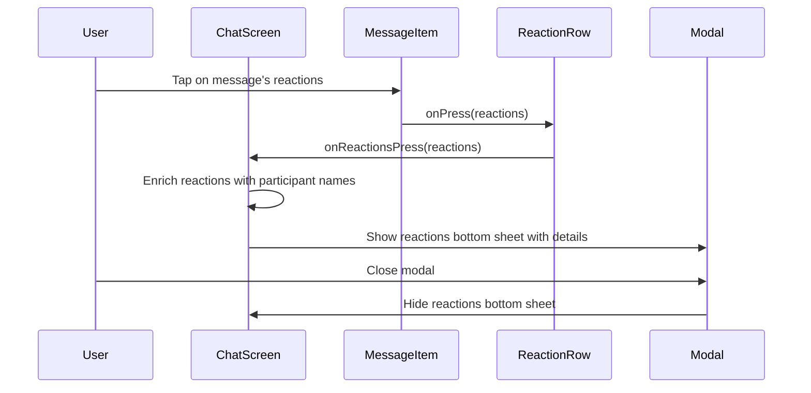

# Tribe Chat App

## Description
A cross-platform React Native single-room chat app for the Tribe Take-Home Exercise. Features a modern UI, robust offline support, and real-time updates via a mock chat server API.

## Features
- Message list with avatars, names, and timestamps
- Edited message indicators
- Reactions row and modal
- Grouping of consecutive messages
- Input bar for new messages
- Image attachments
- Date separators
- Quoted replies
- Efficient hydration and polling
- Infinite upward scroll
- Offline storage (Zustand + AsyncStorage)
- Optimized rendering/minimized re-renders
- Participant details modal
- Image preview modal
- @mentions support

## Tech Stack
- Expo React Native
- Zustand (state management)
- AsyncStorage (persistent storage)
- React Native Modal
- Custom UI components (MessageItem, ReactionRow, DateSeparator, etc.)

## Development Process
This app was developed using both manual coding and AI-assisted workflows:
- Architecture, UI/UX, and feature logic designed and refined with GitHub Copilot Desktop.
- Code Rabbit provided code reviews for quality and documentation.
- Perplexity AI ensured usage of current Expo Go workflows.
- GitHub Copilot streamlined PRs, issue tracking, and repo maintenance.
Manual review and adjustments were made throughout to ensure code quality and alignment with assignment requirements.

## Known Issues & Limitations
- Direct image uploads through the API are not supported (due to dummy server limitations).
- Participant impersonation is not available (API limitation).
- Minor UI quirks may occur on certain devices.
- WebSocket connection would be needed for a better "real time" chat.

## Sequence Example

---

## AI Tools Usage

**AI tools used in this project:**
- Perplexity AI: Researched Expo Go best practices (2025).
- GitHub Copilot Desktop: Assisted with app design, features, and code generation.
- Code Rabbit: Provided code review and documentation support.
- GitHub Copilot (PRs & Issues): Automated pull requests, issues, and branch management.

**AI-assisted workflows:**
- Architecture, UI/UX, and feature logic iterated with Copilot Desktop.
- Code Rabbit reviewed code and helped generate documentation.
- Perplexity AI validated Expo Go workflow choices.
- Copilot GitHub streamlined repository maintenance.

_Manual review and adjustments were made to ensure quality and alignment with assignment requirements._